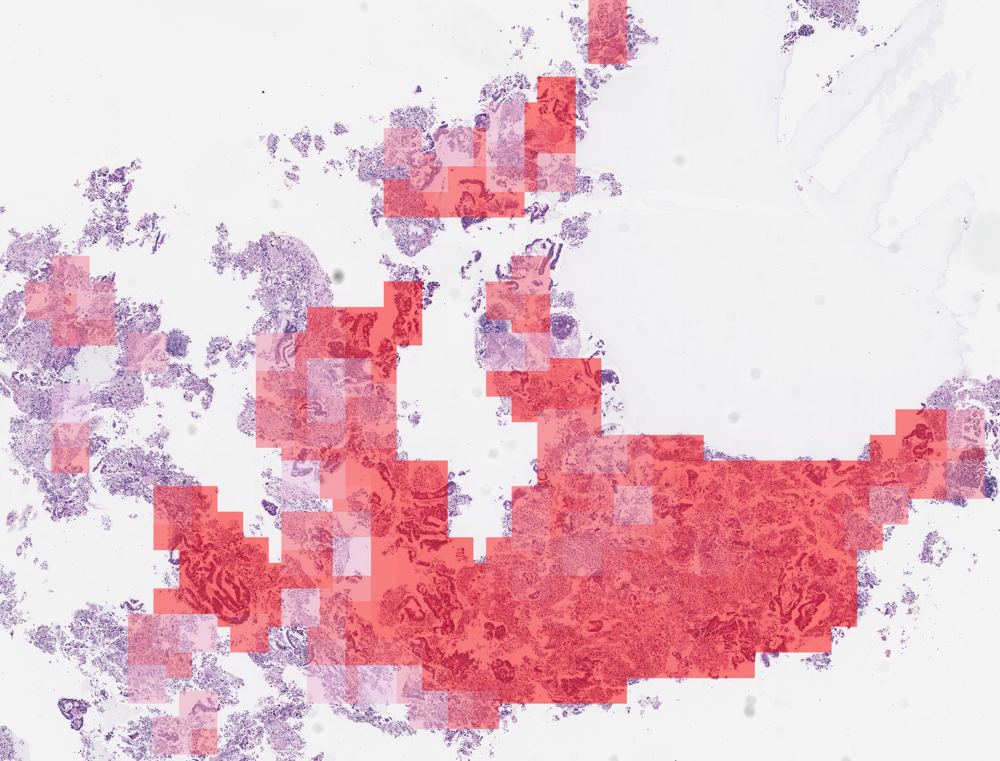
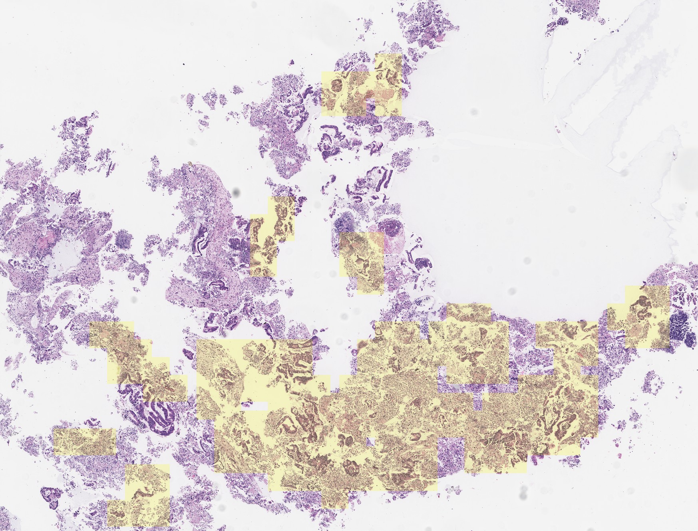
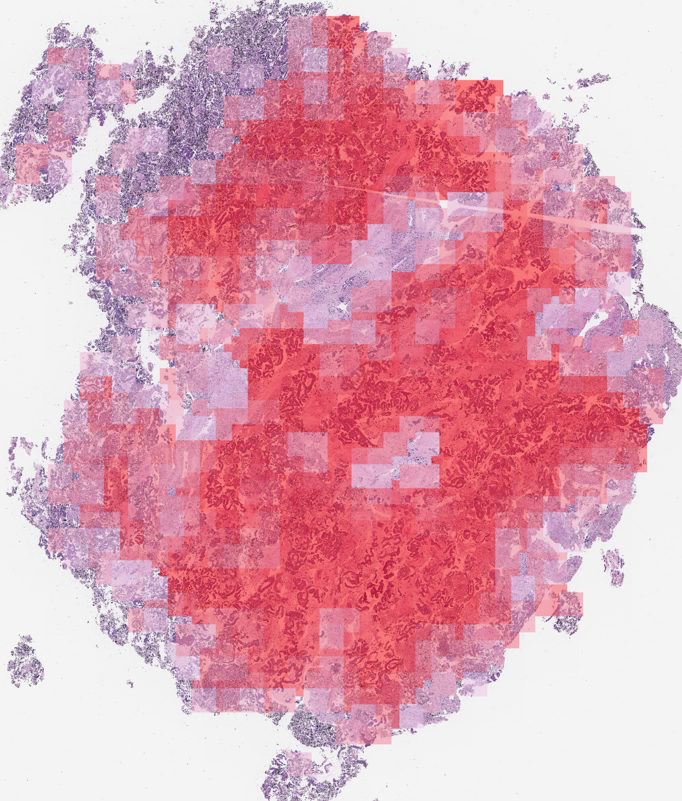
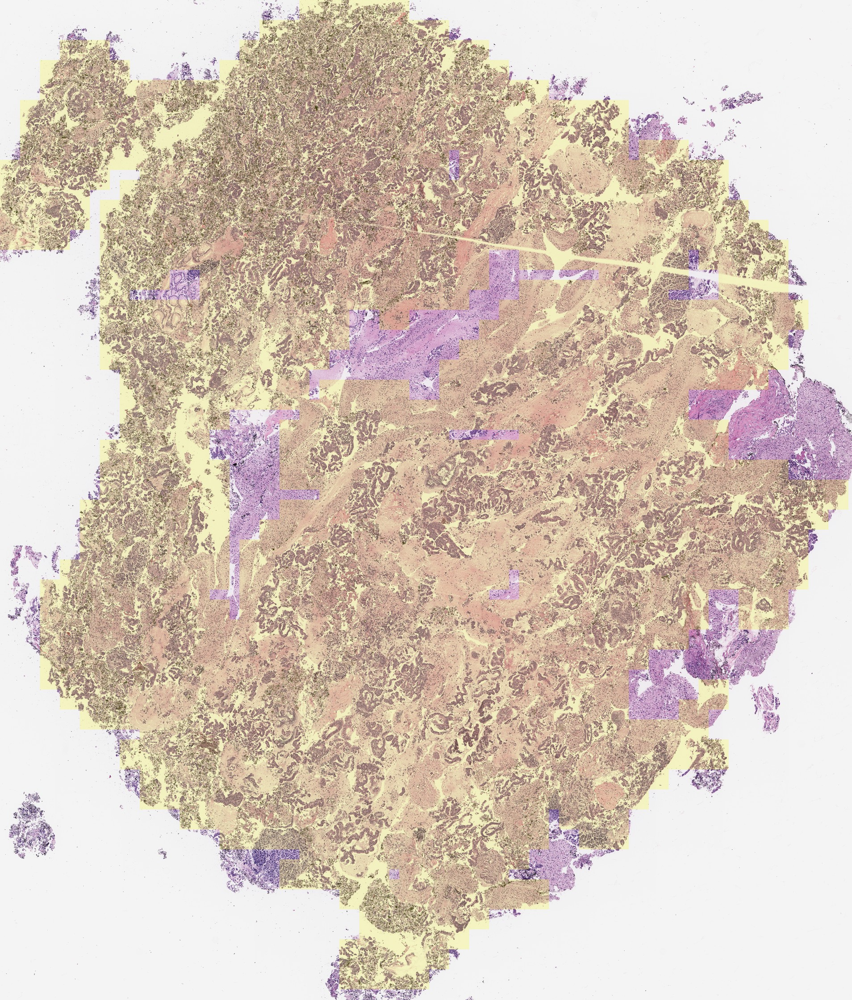
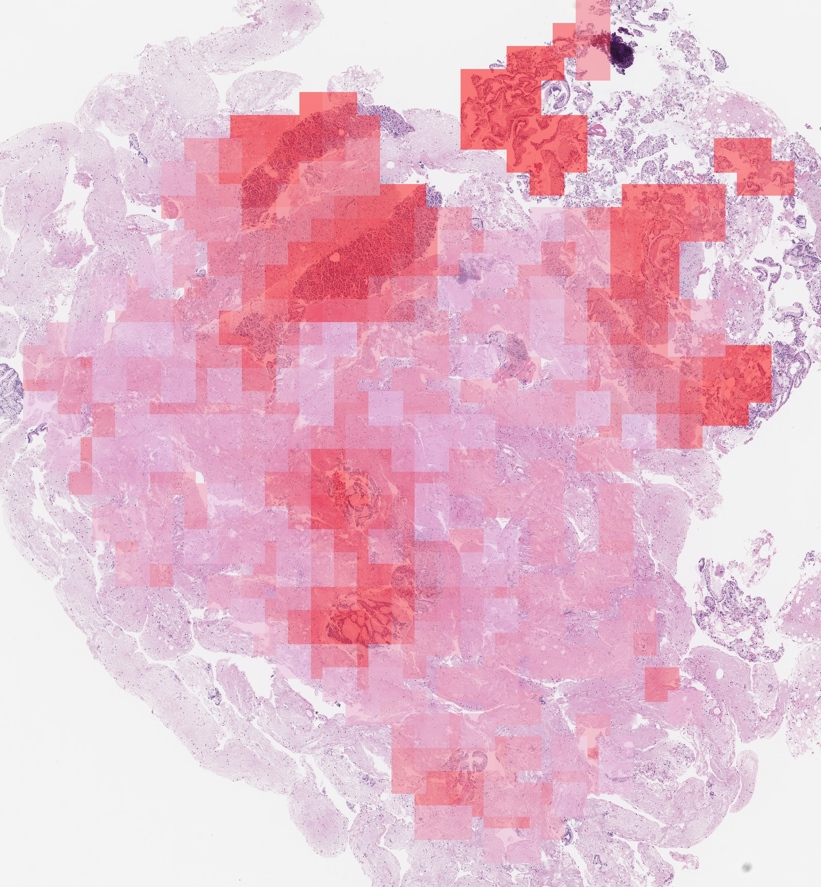
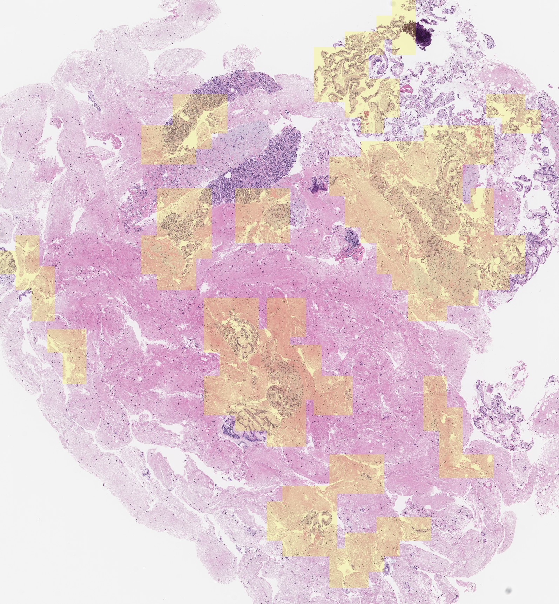
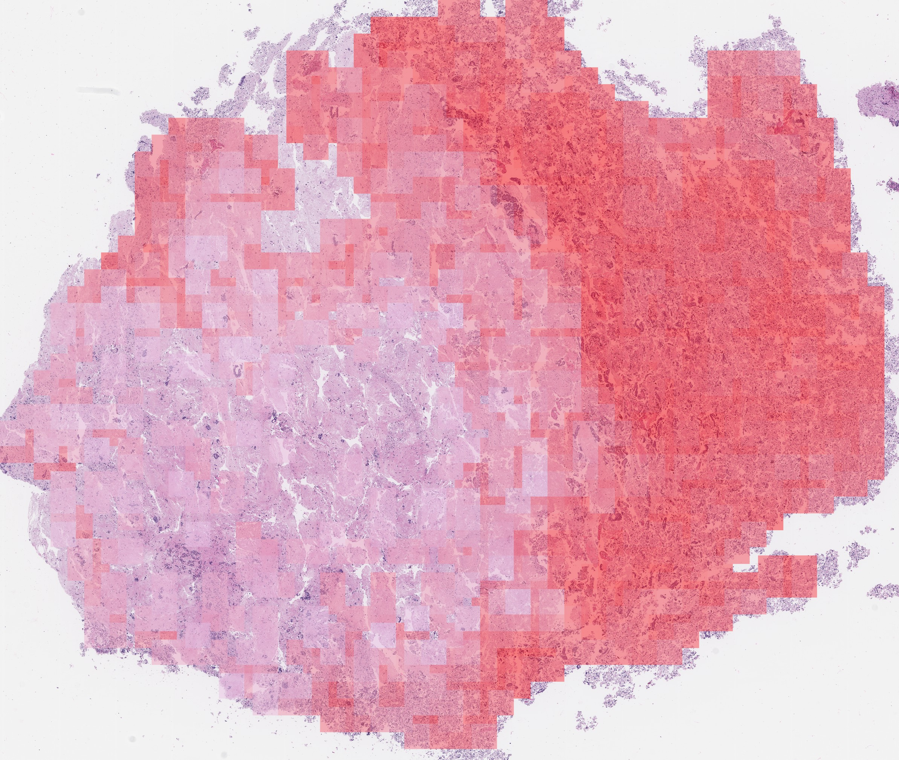
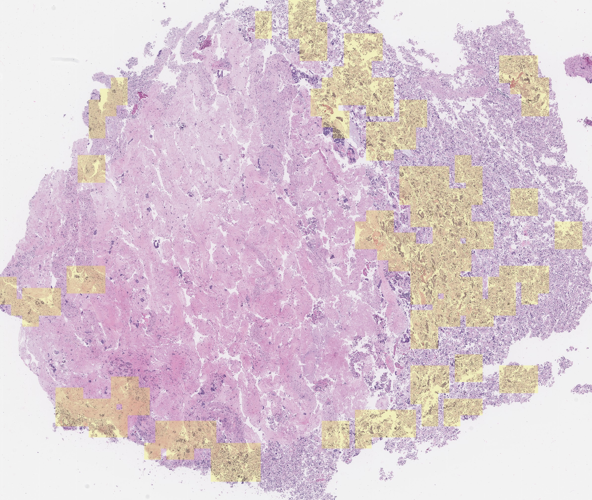

# Slide2Graph
To get the high-dimensional representations & coordinates of patches in one whole slide images, [SlidePreprocessing](https://github.com/BMIRDS/SlidePreprocessing) is used to extract tissue and generate small fixed-size patches from whole slide images. After generating the patches, you can train a patch-level ResNet using the patches, which is what we did. The patches overlapped for 1/3 to generate more patches for better patch-level model training. You are encouraged to generate non-overlap patches in the whole-slide level inference, but patches with 1/3 overlap will still work. Notably, you don't have to train the patch-level model. Based on our experiments, the ResNet pretrained on ImageNet can also be used as a feature extractor here although its performance is not as good as the ResNet trained on specific histopathological patches.
The ResNet without the last FC layer will be utilized to generate the high-dimensional representations for the small fixed-size patch images. 
We include a processed dataset example and a well-trained patch-level ResNet18 model on it in this repo. run `get_data.sh` to get the data.

## Usage
run `python generate_graphs.py` to generate graphs from the patches' coordinates and the extracted high dimensional features of whole slide images. The default setting is creating edges between every node and its four neartest nodes. The edges will be weighted by the reciprocal euclidean distance.

run `python main.py` to train the model. Some parameters can be modifed in `config.py`

## Visualization
  
  
  
  
