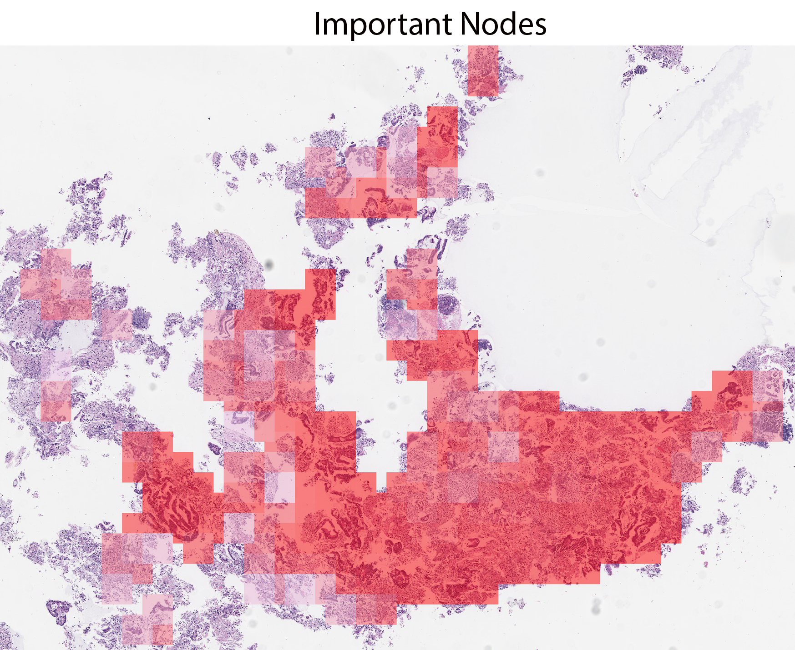
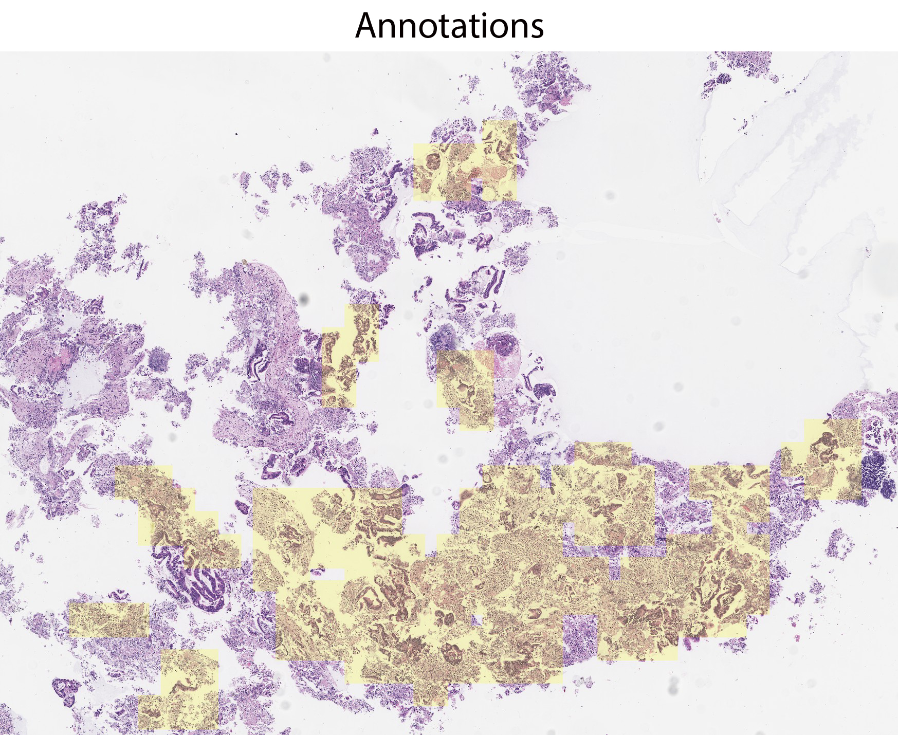
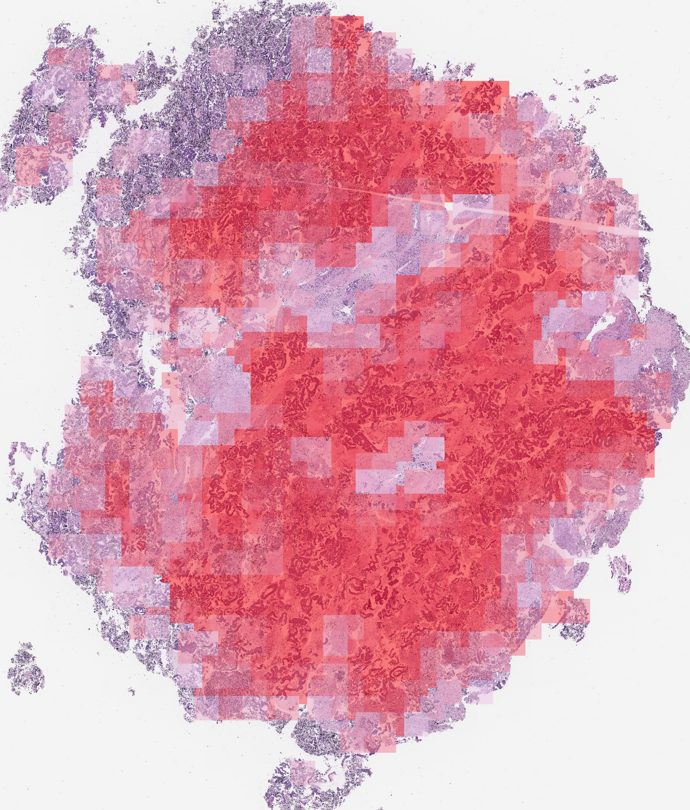
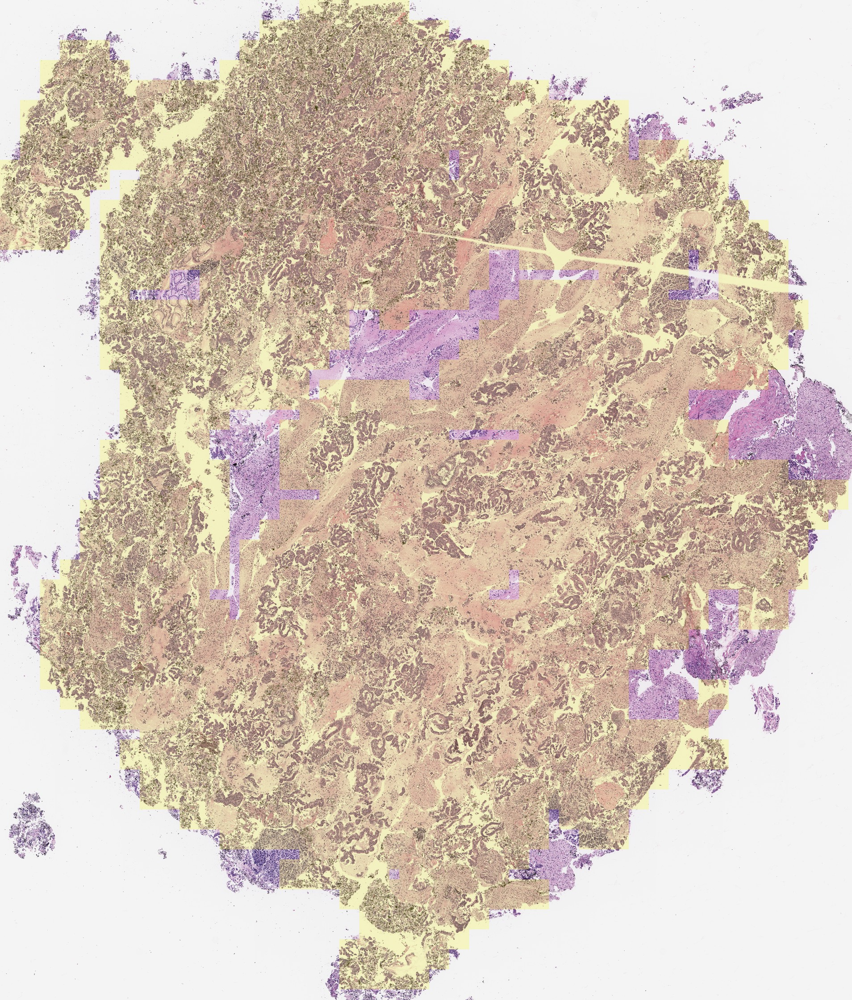
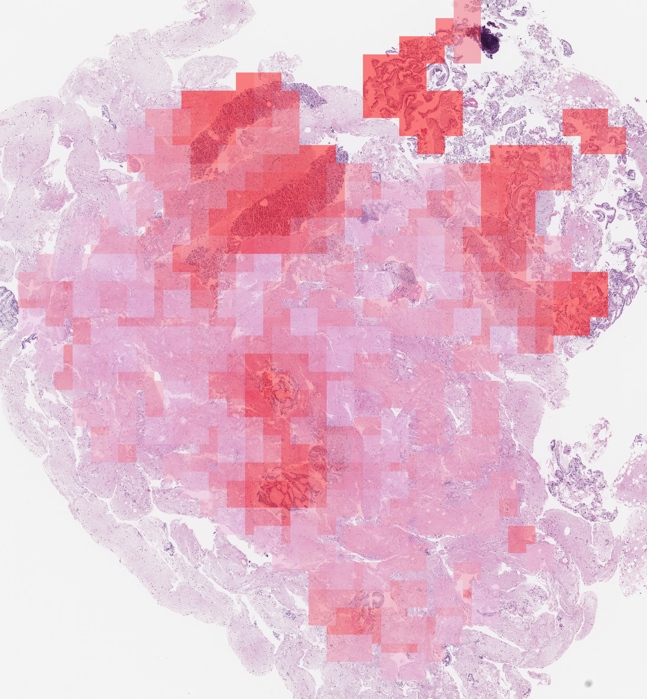
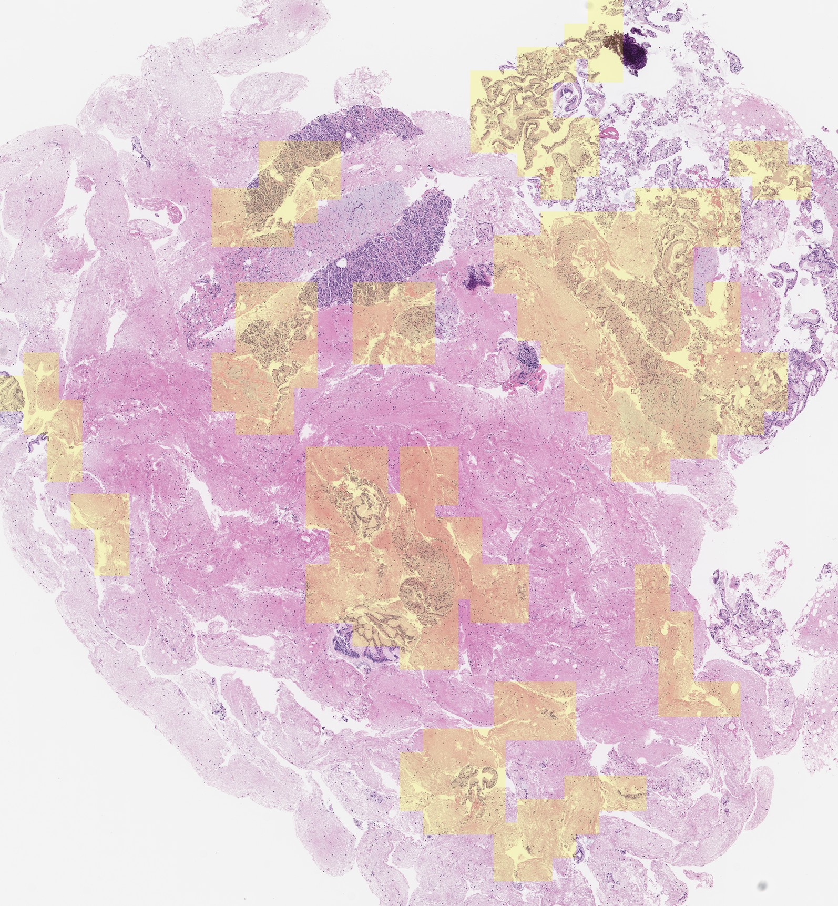
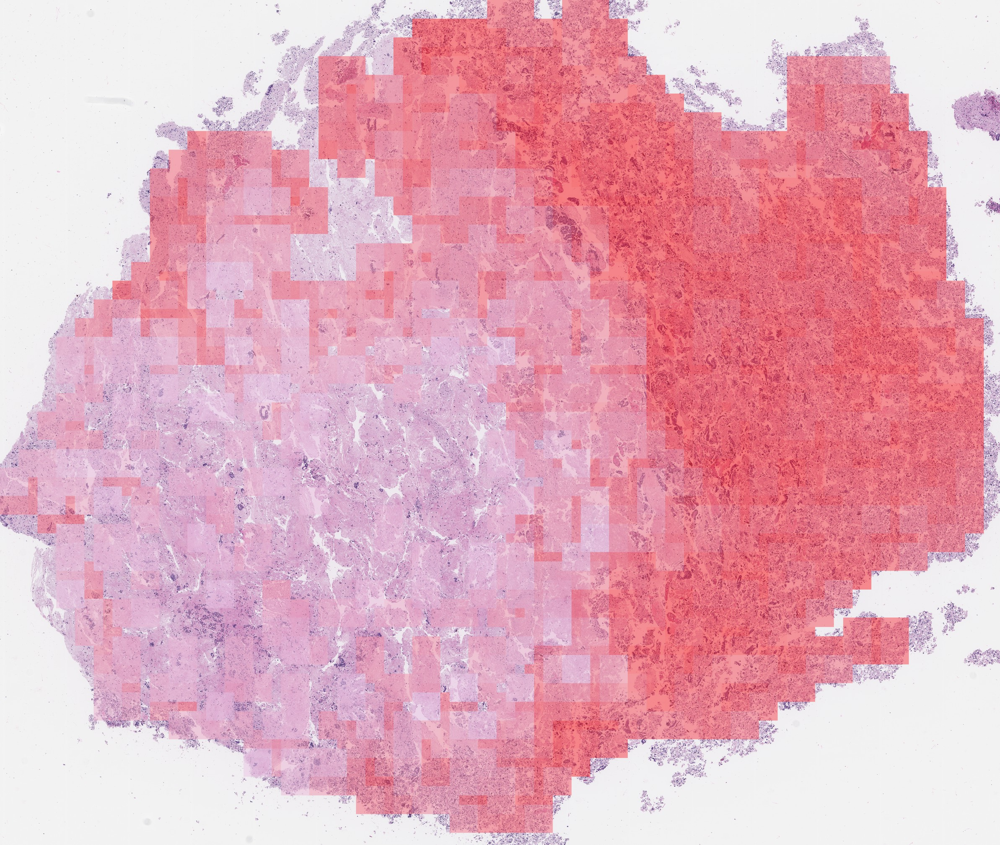
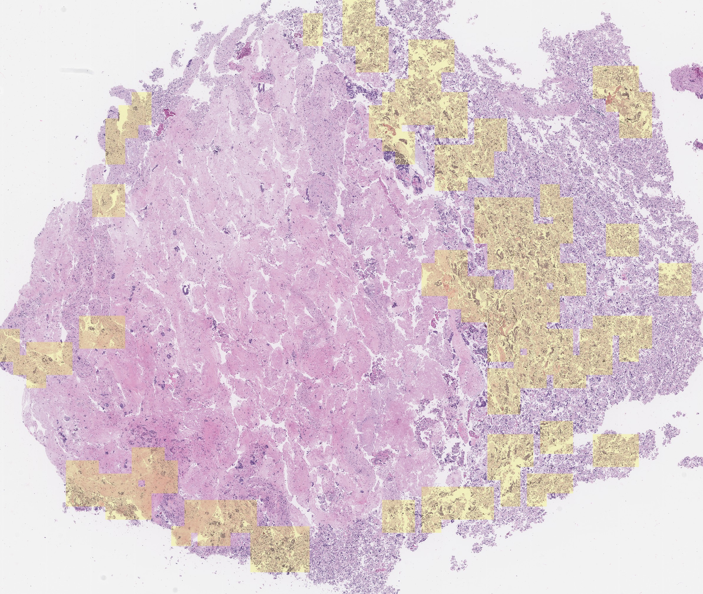

# Slide2Graph: A Graph Convolutional Network-based Whole-Slide Analysis

Slide2Graph provides a way to analyze whole slide images using a graph convolutional neural network. In our framework, a whole slide image can be viewed as a graph where each tissue patch represents a node in the graph. Our Slide2Graph takes both local patches' features and global structural-and-positional information of the patches as inputs to construct a computational graph of a histopathology image. Our study shows that the structural and positional information is a critical component of Slide2Graph in achieving higher performance than a conventional deep convolutional neural network that takes only patch-based features into account.

 

To get the high-dimensional representations & coordinates of patches in one whole slide images, [SlidePreprocessing](https://github.com/BMIRDS/SlidePreprocessing) is used to extract tissue and generate small fixed-size patches from whole slide images. After generating the patches, you can train a patch-level ResNet as a feature extractor using the patches. Notably, you can use a ResNet model pretrained on ImageNet as an alternative feature extractor; however, its performance would be inferior to the ResNet trained on specific histopathological patches. Finally, the ResNet without the last FC layer will be utilized to generate the high-dimensional representations for the small fixed-size patch images. 

## Usage
run `python generate_graphs.py` to generate graphs from the patches' coordinates and the extracted high dimensional features of whole slide images. The default setting is creating edges between every node and its four neartest nodes. The edges will be weighted by the reciprocal euclidean distance.

run `python main.py` to train the model. Some parameters can be modifed in `config.py`

## Visualization
&ensp;&ensp;&ensp;&ensp;&ensp;&ensp;&ensp;&ensp;&ensp;&ensp;&ensp;&ensp;&ensp;&ensp;&ensp;&ensp;&ensp;&ensp;&ensp;&ensp;&ensp;&ensp;&ensp;&ensp;&ensp;&ensp;&ensp;&ensp;&ensp;&ensp;&ensp;&ensp;&ensp;&ensp;Important Nodes  &ensp;&ensp;&ensp;&ensp;&ensp;&ensp;&ensp;&ensp;&ensp;&ensp;&ensp;&ensp;&ensp;&ensp;&ensp;&ensp;&ensp;&ensp;&ensp;&ensp;&ensp;&ensp; Annotations 

 

 

 

 

